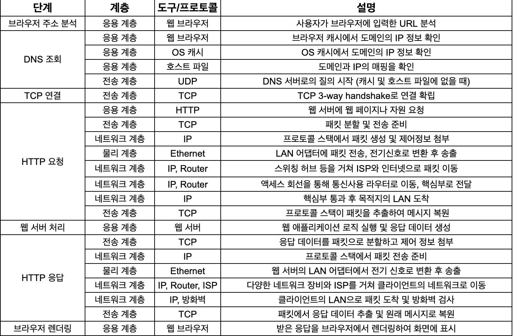

## 웹 브라우저에 URL을 입력했을 때 일어나는 일에 대해 설명해 주시겠습니까?

### 개념 설명

- 기본적인 과정은 위와 같으나, 트래픽을 분산 시킬 필요가 있는 경우 GSLB(Global Server Load Balancing)와 CDN(Content Delivery Network)을 고려해볼 수 있을 것 같습니다.

## 꼬리 질문

### GSLB와 CDN은 왜 적용해야합니까?

답변

- GSLB(Global Server Load Balancing)는 전 세계의 여러 데이터 센터나 서비스 지점에 분산된 서버들 사이에서 트래픽을 효율적으로 분산시키는 기술입니다. 
- CDN(Content Delivery Network)는 전세계 여러 위치에 콘텐츠를 복제 및 캐시하여 사용자에게 빠르고 신뢰성 있는 웹 콘텐츠 전송을 지원하는 분산 네트워크 시스템입니다

- 즉, GSLB는 전세계적인 트래픽 분산과 장애 대응에 중점을 둔 기술이며, 
CDN은 특정 지점 내에서의 콘텐츠 배포와 속도 향상에 중점을 둔 기술입니다. 

- 두 기술을 함께 사용할 경우에는 웹 서비스의 성능과 안정성을 크게 향상시킬 수 있습니다.

### GSLB와 CDN을 적용한 경우, 어떤 과정을 거치게 됩니까?

답변

- 클라이언트가 DNS 조회를 실시하면 우선적으로 GSLB 솔루션에 도달합니다.
- GSLB는 사용자의 위치, 각 데이터 센터의 health check, 트래픽 로드 등을 고려하여 사용자에게 가장 적합한 데이터 센터나 서버, CDN 위치로 안내하기 위한 DNS 응답을 생성합니다.
- 이 때, GSLB로부터 반환된 IP 주소가 CDN의 엣지 서버를 가리키고 있다면, 이후에 CDN 구성 요소가 작동합니다.
- CDN의 DNS 구성 요소는 사용자를 해당 엣지 서버로 직접 안내하거나, 더욱 최적화된 다른 엣지 서버로 리디렉션할 수 있습니다.
- 사용자는 이 엣지 서버에서 캐시된 콘텐츠를 받아오거나, 콘텐츠가 캐시되어 있지 않다면 원본 서버로부터 콘텐츠를 가져와 사용자에게 제공합니다.

### 현재 회사의 서비스가 GSLB와 CDN이 적용되어 있고, 로그인 방법은 세션을 사용한다고 가정합시다. 유저가 기존에 로그인 했던 서버가 죽어서 다른 서버에 연결되었을 경우 세션은 어떻게 유지시킬 수 있습니까?

답변

세션 DB를 어떻게 구성하느냐에 따라 2가지 방법을 고려할 수 있을 것 같습니다.

- 세션 리플리케이션 (Session Replication)
    서버 간에 세션 정보를 복제하여, 하나의 서버에서 문제가 발생하더라도 사용자의 세션 정보가 다른 서버에도 존재하도록 합니다. 
    동기 리플리케이션은 세션 정보의 일관성을 보장하지만, 네트워크 지연을 유발할 수 있습니다. 비동기 리플리케이션은 성능은 향상시키지만, 데이터 불일치의 가능성이 있습니다.
- 세션 스토리지 분리 (Centralized Session Store)
    세션 정보를 서버 외부의 중앙 데이터 저장소(DB, Cache 서버 등)에 저장하여, 각 서버가 이 저장소를 참조함으로써 세션 정보를 공유합니다. 
    Redis, Memcached와 같은 인메모리 데이터 스토어가 이런 용도로 자주 사용됩니다. 
    이 방법은 네트워크 비용이 발생하지만, 서버 간의 세션 정보 동기화를 걱정할 필요가 없습니다.

세션 외에 다른 방법도 고려가 가능하다면 Token 기반 로그인으로 변경하는 방법도 고려할 수 있을 것 같습니다.

- 토큰 기반 인증 (Token-Based Authentication)
    서버는 인증 후 생성한 토큰을 클라이언트에게 전달합니다. 클라이언트는 이후 요청마다 이 토큰을 포함시켜 인증 정보를 제공합니다. 서버는 공유된 키 또는 증명서를 사용하여 토큰의 유효성을 검사하므로, 상태를 저장할 필요가 없습니다.

