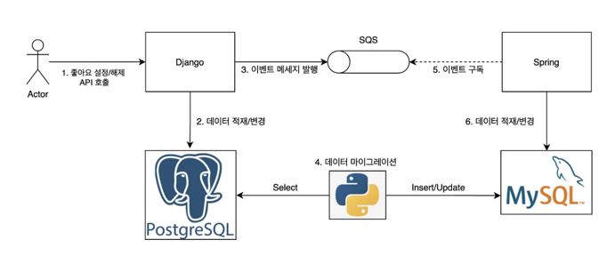

## 질문
여우가 생각하는 하위 호환성이란 무엇이고, 이와 관련된 고민을 해본 적이 있나요?

### 개념 설명
**Cross-Version Compatibility**라는 단어로 불리는 **하위 호환성**은
동일한 제품의 코드가 다른 버전에서도 호환되는지와 관련한 용어입니다.

호환성의 방향에 따라 하위 호환성과 상위 호환성으로 나눌 수 있습니다.
하위 호환성은 하위 버전에 있는 제품의 코드 또는 기능이 최신 제품과 호환될 때를 지칭합니다.
MS Office 2007에서 MS Office 2003 때 만들어진 기능을 사용할 수 있는

상위 호환성은 하위 호환성과 반대로 최신 버전의 코드 또는 기능을 이전 버전에서도 사용할 수 있는가에 대한 것인데,
일반적으로 하위 호환성보다 구현하기 더 어려운 것으로 알려져 있습니다.
예를 들면 'MS Office 2003 버전에서 MS Office 2007 버전의 기능을 사용할 수 있는가?' 가 상위 호환성의 예시인데,
예시만 보아도 하위 호환에 비해 구현하기 힘들어 보이죠.

클라이언트와 API를 통해 소통하는 API 개발자의 경우에는 API의 하위/상위 호환성을 신경써야 하고, 
이 경우에는 호환성보다 **API 버전 관리**라는 용어를 더 많이 사용합니다.

## 꼬리 질문
그럼 API 버전 관리는 어떤 방식으로 할 수 있을까요?

### 답변
일반적으로 클라이언트가 이용하고 있는 서비스의 버전 정보를 요청에 명시해서 보내주면,
서비스 측에서는 해당 버전에 알맞는 작업을 하는 방식으로 버전 관리가 이루어집니다.
HTTP 통신을 한다고 가정했을 때 버전을 명시하는 방법으로는
* URL에 버전을 명시하는 방법(api/v1/users/, api/v2/users/)
* 쿼리 매개변수에 버전을 명시하는 방법(api/users/?version=1)
* 사용자 정의 헤더에 버전을 명시하는 방법

## 꼬리 질문
어떤 버전까지는 최신 버전에서 호환해주고, 어떤 버전까지는 안 해주는지 기준을 어떻게 세울 수 있을까요?

### 답변
보통 버전을 명시할 때, **시멘틱 버저닝**방식을 많이 사용하는데, x.y.z 형식으로 명시하는 버전의 어떤 부분이 변경되느냐에 따라 호환 여부가 결정됩니다.

제일 끝에 있는 z는 자잘한 버그 수정 등의 작업을 하는 PATCH 버전에 해당하는데, PATCH 업데이트의 경우 API나 데이터베이스 등에 가시적인 변경이 없습니다. 따라서 하위 호환성을 보장하기 쉬운 버전 변경에 속합니다.

y는 기능이 변경되거나 추가되더라도, 직전 버전의 API 명세를 그대로 사용하는 MINOR 업데이트에서 사용할 수 있습니다. MINOR 업데이트시에는 이전 버전과의 하위 호환성을 보장하도록 신경써서 구현할 필요가 있습니다.

x는 이전 버전과 호환되지 않는 API 변경을 포함한 업데이트 시 명시하는 MAJOR 업데이트에서 사용할 수 있습니다. 통상적으로 서로 다른 x버전끼리는 호환되지 않으며, x버전이 동일한 버전끼리는 하위 호환성이 보장되도록 구현해야 합니다.
x버전이 0인 경우에는 사용 중간에 사용법이 지속적으로 변하는 불안정(unstable) 환경에서 사용되며, 1 이상으로 올라가는 경우 각 버전 내에서 API 명세가 크게 변하지 않으며 바뀌더라도 이전 버전과의 호환성을 보장해준다는 것을 예상할 수 있습니다.

그런데 Semver(시멘틱 버저닝의 준말)은 회사나 개발자들마다 정하는 기준이 달라, 어떤 업데이트 때는 어떤 버전을 올려야 하는건지 헷갈릴 때가 많다고 합니다.
그래서 어떤 회사는 버그 수정은 Patch, 기능 추가는 Minor, 기능 제거는 Major로 관리하기도 한다고 합니다.
그리고 Line에서는 자체적으로 만든 headver라는 방식의 버저닝 전략을 통해, Major 버전만을 수동으로 관리하고 Minor와 Patch는 각각 년월, 그리고 자동 증가하는 빌드 번호를 사용하도록 하여
관리 포인트를 줄이는 전략을 취하기도 합니다.

## 꼬리 질문
V1에서 V2로 버전 업데이트가 되었는데, 두 버전의 데이터베이스 컬럼 정보가 다르다고 가정한다면, V1와 V2의 호환성을 어떻게 보장하나요?

### 답변
정답이 없는 문제이기에 저의 생각을 말씀드리자면,
먼저 V1와 V2 데이터베이스 테이블을 각각 따로 둔 후,
V1의 데이터를 조회해 전처리 작업을 수행한 후 V2에 적재하는 작업을 진행할 것입니다.
기존 데이터를 적재하면서, 그동안 실시간으로 쌓이는 데이터 또한 V2에 반영해야 하기 때문에
V1과 V2 테이블을 실시간으로 정확히 동기화시키는 것이 과제가 될 것 같습니다.

이는 하위 호환성보다도 데이터의 '무중단 마이그레이션' 이라는 주제의 고민에 더 가깝습니다.

* 제일 간단하게 해결하려면 서비스를 중지시킨 후, V1의 데이터를 V2에 옮긴 후 서비스를 재개하면 됩니다.
하지만 데이터 행이 많은 빅데이터의 경우에는 마이그레이션 시간이 분 단위가 아닌 시간 단위로 걸릴 수 있고,
장기간 서비스를 중지하는 것은 유저 경험 측면에서 좋지 않습니다.

* 서비스를 중단하지 않으면서도 동기화를 완료하려면, 마이그레이션을 진행하는 동안 V1에서 신규로 발생하는 데이터 변경 이벤트는 메시지 큐에 쌓습니다. 그리고 기존 데이터들에 대한 마이그레이션이 끝나고 나면 메시지 큐에서 이벤트를 순서대로 가져와 실행하면서 데이터의 최신화 작업을 시작합니다. 이 방식을 사용한다면 서비스를 중단하지 않고도 V1 테이블과 V2 테이블이 실시간 동기화를 유지하여, 두 테이블에 접근하는 두 버전의 API 모두를 지원할 수 있습니다. 

### 자료
[호환성에 대한 고찰](https://architecture101.blog/2008/05/26/compatibility/)

[29cm(무신사)의 데이터 무중단 마이그레이션](https://medium.com/29cm/api-v2-전환과-db-무중단-마이그레이션-후기-8b39eb0db566)
